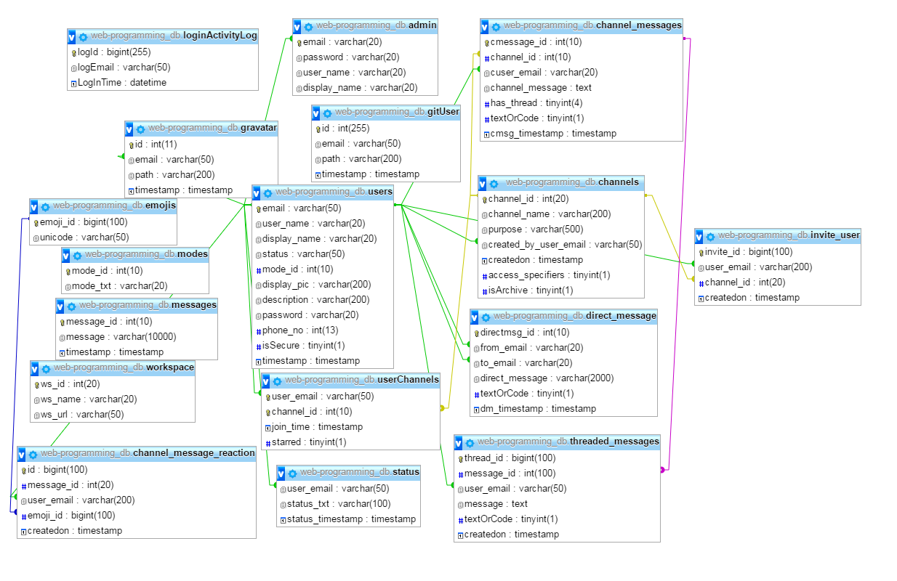
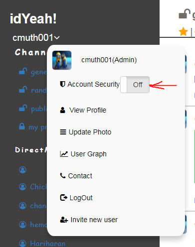
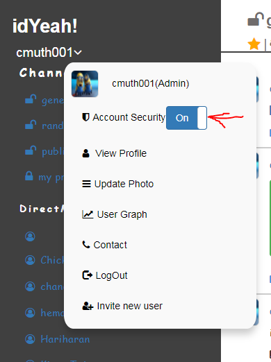
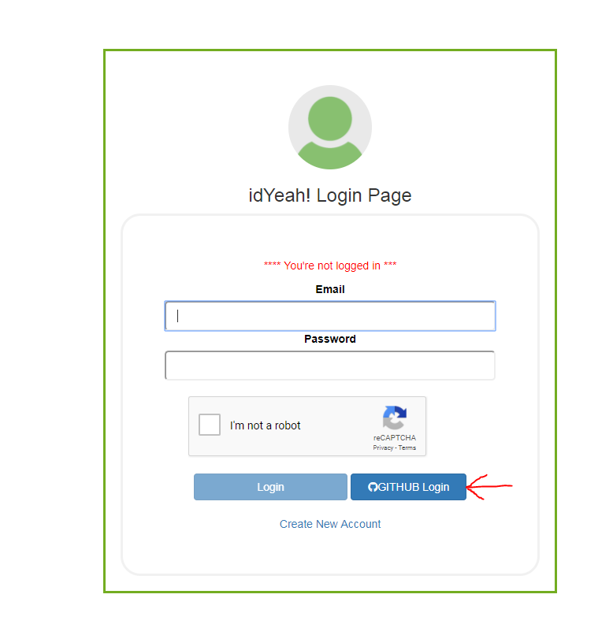
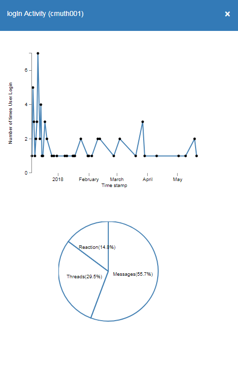

  <h1 align="center">idYeah!</h1>
  <h4 align="center">(A messaging chat room website like Slack using a LAMP stack)</h4>
  
 <a  href = "http://qav2.cs.odu.edu/chandu/web-programming/login/login.php"> Live Site</a>&nbsp;&nbsp;&nbsp;&nbsp;| &nbsp;&nbsp; <a href="http://qav2.cs.odu.edu/chandu/web-programming/helpPage.html" >Survival Guide</a>

 
### Introduction
  &nbsp;&nbsp;&nbsp;&nbsp;&nbsp;&nbsp;We took **Slack** to be our model on which our website was to be based. However, we have also added few additional features in order to meet the expectations of our target audience. Slack is a chatroom which is an acronym for **Searchable Log of All Conversation and Knowledge**. As the name indicates, all the content is searchable in Slack. Basically, it is a place for collaboration that works by sending an invitation by the admin or owner to work on a specific project. However, it also has room for direct messaging between the users present in the chatroom.
  
  &nbsp;&nbsp;&nbsp;&nbsp;&nbsp;&nbsp;**idYeah!** (platform to share and collaborate on ideas) was made for a similar purpose. However, there are ways in which both the chatrooms differ. In idYeah!, only select content is searchable. Also, users can post code snippets along with pictures and URLs as messages in any group and take feedback or suggestions for the same. Basically, the code snippet feature in our chatroom is to bring ideas to life. we have seen a number of websites accepting the credentials of one of the reputed or authentic sites used by a person. Considering this, GitHub based login was implemented. Users can also use a globally recognized avatar as their default image. Account security is a priority, so an optional two-step authentication has been provided. One additional feature is: existing users are gauged based on their participation in the channels on their profile page. Also, a graphical view of their participation is provided in the user options.
 
 ### Key Functionalities:
- Can create new public and private channels and add registered members to that channel.
- Archiving a channel.
- Like and Dislike for a post.
- Admin can delete posts from public channels .
- Admin can delete a member from the public channel.
- User can upload images, documents and code snippets.
- User Activity Graph.
- Two Factor Authentication .
- User profile search.
- Login with GitHub.
- Provided an option to use Gravatar image.

### DataBase Schema Design
 
|   |
|:---:|
| DB Schema Design |  

### Two-step authentication
 &nbsp;&nbsp;&nbsp;&nbsp;&nbsp;&nbsp;Two step authentication has become a common method to implement a secure login process, though we made it available as an option to the user. The user can activate or deactivate this method of authentication by clicking the on and off button in the menu. Once this option is activated the user is sent an email at the time of logging in after verifying his password and captcha, with a one-time passcode prompting authentication. After entering the passcode present in the email, it is verified and the user is redirected to the homepage. Once the passcode is generated by the passcode generator, it is passed through the session variable to the evaluation page and is evaluated against the passcode entered by the user and if it is a match, the user is allowed to the home page.

| []  | [] |
|:---:|:---:|
| 2FA OFF | 2FA ON | 
 ### GITHUB Integration
  &nbsp;&nbsp;&nbsp;&nbsp;&nbsp;&nbsp;Users have an option of logging in to our website using **GITHUB** credentials. This is achieved by using the services provided by the GITHUB. Once the user clicks on the Login with **GITHUB** option, the user is taken to a new page where he is prompted to enter his credentials and is authenticated by GITHUB. GITHUB checks his credentials and sends a response code denting a success or a failure. If the response denotes a success, the user is redirected to his home page, else he is asked to enter the correct credentials. If the response code denotes a success, along with the response user details are also sent which are used to compare with the user list in the Database and provide the user with his information.
 
|   |
|:---:|
| GITHUB Login |  

 ### Graphs for Metrics
  &nbsp;&nbsp;&nbsp;&nbsp;&nbsp;&nbsp;Every user’s participation is depicted by the means of a graph. A user’s messages and reaction in a channel are the parameters that are used to measure the performance metrics. The overall performance in a channel is calculated on a scale of 100 units. The metrics keep varying for every new post or reaction by a user.

|   |
|:---:|
| User Metrics Graphs |  

